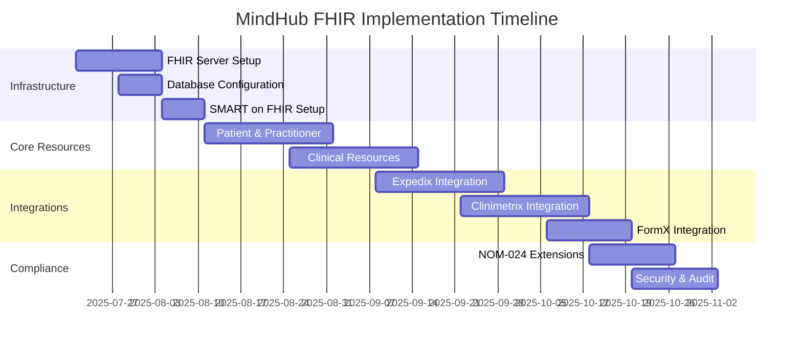

# MindHub HL7 FHIR R4 Implementation Architecture

## Resumen Ejecutivo

Este documento define la arquitectura técnica para la implementación del estándar HL7 FHIR R4 en la plataforma MindHub Healthcare, asegurando interoperabilidad completa entre todos los módulos del sistema y cumplimiento con normativas mexicanas de salud.

---

## 1. Arquitectura General FHIR

### 1.1 Principios de Diseño

#### Interoperabilidad Semántica
- **Estándar Base**: HL7 FHIR R4.0.1 (versión actual estable)
- **Perfiles Mexicanos**: Extensiones específicas para cumplimiento NOM-024
- **Terminologías**: SNOMED CT, LOINC, ICD-10, CIE-10 (México)
- **Idiomas**: Soporte completo español/inglés

#### Modularidad y Escalabilidad
```javascript
const fhirArchitecture = {
  core: {
    version: 'FHIR_R4_4.0.1',
    encoding: ['JSON', 'XML'],
    transport: 'RESTful_HTTP',
    security: 'OAuth2_SMART_on_FHIR'
  },
  profiles: {
    international: 'HL7_International_Profiles',
    mexican: 'MX_Healthcare_Profiles',
    mindhub: 'MindHub_Custom_Extensions'
  },
  terminology: {
    primary: 'SNOMED_CT',
    laboratory: 'LOINC',
    diagnosis: 'ICD_10_CM',
    mexican_specific: 'CIE_10_Mexico'
  }
}
```

### 1.2 Componentes Principales

#### FHIR Server Core
- **Servidor FHIR**: HAPI FHIR (Java) o FHIR.js (Node.js)
- **Base de Datos**: PostgreSQL con extensiones JSON
- **Cache**: Redis para consultas frecuentes
- **Indexación**: Elasticsearch para búsquedas complejas

#### API Gateway FHIR
```javascript
const fhirGateway = {
  endpoints: {
    base: '/fhir/R4',
    metadata: '/fhir/R4/metadata',
    search: '/fhir/R4/{resourceType}',
    crud: '/fhir/R4/{resourceType}/{id}'
  },
  authentication: 'SMART_on_FHIR',
  rateLimit: '1000_requests_per_minute',
  versioning: 'header_based'
}
```

---

## 2. Perfiles de Recursos FHIR

### 2.1 Recursos de Paciente

#### Patient (Paciente)
```json
{
  "resourceType": "Patient",
  "id": "mx-patient-example",
  "meta": {
    "profile": ["http://mindhub.com/fhir/StructureDefinition/MXPatient"]
  },
  "identifier": [
    {
      "use": "official",
      "type": {
        "coding": [{
          "system": "http://hl7.org/fhir/v2/0203",
          "code": "CURP",
          "display": "Clave Única de Registro de Población"
        }]
      },
      "system": "http://www.gob.mx/curp",
      "value": "XEXX010101HNEXXXA4"
    },
    {
      "use": "secondary",
      "type": {
        "coding": [{
          "system": "http://hl7.org/fhir/v2/0203",
          "code": "NSS",
          "display": "Número de Seguridad Social"
        }]
      },
      "system": "http://www.imss.gob.mx",
      "value": "12345678901"
    }
  ],
  "name": [{
    "use": "official",
    "family": "González",
    "given": ["María", "Carmen"],
    "suffix": ["Dra."]
  }],
  "gender": "female",
  "birthDate": "1985-03-15",
  "address": [{
    "use": "home",
    "type": "physical",
    "line": ["Av. Insurgentes Sur 1234", "Col. Del Valle"],
    "city": "Ciudad de México",
    "state": "CDMX",
    "postalCode": "03100",
    "country": "MX",
    "extension": [{
      "url": "http://mindhub.com/fhir/StructureDefinition/municipality",
      "valueString": "Benito Juárez"
    }]
  }],
  "telecom": [{
    "system": "phone",
    "value": "+52-55-1234-5678",
    "use": "mobile"
  }, {
    "system": "email",
    "value": "maria.gonzalez@email.com",
    "use": "home"
  }],
  "extension": [{
    "url": "http://mindhub.com/fhir/StructureDefinition/emergency-contact",
    "extension": [{
      "url": "name",
      "valueString": "Carlos González"
    }, {
      "url": "relationship",
      "valueCodeableConcept": {
        "coding": [{
          "system": "http://terminology.hl7.org/CodeSystem/v3-RoleCode",
          "code": "HUSB",
          "display": "Esposo"
        }]
      }
    }, {
      "url": "telecom",
      "valueContactPoint": {
        "system": "phone",
        "value": "+52-55-8765-4321"
      }
    }]
  }]
}
```

#### Practitioner (Profesional de Salud)
```json
{
  "resourceType": "Practitioner",
  "id": "mx-practitioner-psychiatrist",
  "meta": {
    "profile": ["http://mindhub.com/fhir/StructureDefinition/MXPractitioner"]
  },
  "identifier": [
    {
      "use": "official",
      "type": {
        "coding": [{
          "system": "http://terminology.hl7.org/CodeSystem/v2-0203",
          "code": "MD",
          "display": "Cédula Profesional"
        }]
      },
      "system": "http://www.sep.gob.mx/cedula",
      "value": "1234567"
    },
    {
      "use": "secondary",
      "type": {
        "coding": [{
          "system": "http://mindhub.com/fhir/CodeSystem/identifier-type",
          "code": "SSA",
          "display": "Registro SSA"
        }]
      },
      "system": "http://www.gob.mx/salud/ssa",
      "value": "SSA-7654321"
    }
  ],
  "name": [{
    "use": "official",
    "family": "Hernández",
    "given": ["Ana", "Patricia"],
    "prefix": ["Dra."]
  }],
  "qualification": [{
    "code": {
      "coding": [{
        "system": "http://snomed.info/sct",
        "code": "394587001",
        "display": "Psiquiatría"
      }]
    },
    "period": {
      "start": "2010-06-15"
    },
    "issuer": {
      "display": "Universidad Nacional Autónoma de México"
    }
  }, {
    "code": {
      "coding": [{
        "system": "http://snomed.info/sct",
        "code": "394913002",
        "display": "Psiquiatría de Adolescentes"
      }]
    },
    "period": {
      "start": "2015-08-20"
    },
    "issuer": {
      "display": "Consejo Mexicano de Psiquiatría"
    }
  }]
}
```

### 2.2 Recursos Clínicos

#### Observation (Observación/Medición)
```json
{
  "resourceType": "Observation",
  "id": "mx-observation-mental-status",
  "meta": {
    "profile": ["http://mindhub.com/fhir/StructureDefinition/MXMentalHealthObservation"]
  },
  "status": "final",
  "category": [{
    "coding": [{
      "system": "http://terminology.hl7.org/CodeSystem/observation-category",
      "code": "survey",
      "display": "Encuesta"
    }]
  }],
  "code": {
    "coding": [{
      "system": "http://loinc.org",
      "code": "72133-2",
      "display": "Beck Depression Inventory II score"
    }, {
      "system": "http://snomed.info/sct",
      "code": "273249006",
      "display": "Assessment of depression"
    }]
  },
  "subject": {
    "reference": "Patient/mx-patient-example"
  },
  "effectiveDateTime": "2025-07-20T10:30:00-06:00",
  "performer": [{
    "reference": "Practitioner/mx-practitioner-psychiatrist"
  }],
  "valueQuantity": {
    "value": 18,
    "unit": "score",
    "system": "http://unitsofmeasure.org",
    "code": "{score}"
  },
  "interpretation": [{
    "coding": [{
      "system": "http://terminology.hl7.org/CodeSystem/v3-ObservationInterpretation",
      "code": "H",
      "display": "Alto"
    }]
  }],
  "component": [{
    "code": {
      "coding": [{
        "system": "http://loinc.org",
        "code": "72134-0",
        "display": "Beck Depression Inventory II mood item score"
      }]
    },
    "valueQuantity": {
      "value": 3,
      "unit": "score",
      "system": "http://unitsofmeasure.org",
      "code": "{score}"
    }
  }]
}
```

#### DiagnosticReport (Reporte Diagnóstico)
```json
{
  "resourceType": "DiagnosticReport",
  "id": "mx-diagnostic-report-psychological",
  "meta": {
    "profile": ["http://mindhub.com/fhir/StructureDefinition/MXPsychologicalReport"]
  },
  "status": "final",
  "category": [{
    "coding": [{
      "system": "http://terminology.hl7.org/CodeSystem/v2-0074",
      "code": "PSY",
      "display": "Psicología"
    }]
  }],
  "code": {
    "coding": [{
      "system": "http://loinc.org",
      "code": "11492-6",
      "display": "Current psychological assessment"
    }]
  },
  "subject": {
    "reference": "Patient/mx-patient-example"
  },
  "effectiveDateTime": "2025-07-20T14:00:00-06:00",
  "performer": [{
    "reference": "Practitioner/mx-practitioner-psychologist"
  }],
  "result": [{
    "reference": "Observation/mx-observation-mental-status"
  }],
  "conclusion": "Paciente presenta síntomas moderados de depresión según la escala BDI-II. Se recomienda seguimiento psicoterapéutico y evaluación psiquiátrica para considerar tratamiento farmacológico.",
  "conclusionCode": [{
    "coding": [{
      "system": "http://hl7.org/fhir/sid/icd-10-cm",
      "code": "F32.1",
      "display": "Major depressive disorder, single episode, moderate"
    }]
  }]
}
```

#### MedicationRequest (Prescripción)
```json
{
  "resourceType": "MedicationRequest",
  "id": "mx-medication-request-antidepressant",
  "meta": {
    "profile": ["http://mindhub.com/fhir/StructureDefinition/MXPrescription"]
  },
  "status": "active",
  "intent": "order",
  "medicationCodeableConcept": {
    "coding": [{
      "system": "http://www.nlm.nih.gov/research/umls/rxnorm",
      "code": "31565",
      "display": "Sertraline"
    }, {
      "system": "http://mindhub.com/fhir/CodeSystem/mx-medications",
      "code": "SERTR-50MG",
      "display": "Sertralina 50mg"
    }]
  },
  "subject": {
    "reference": "Patient/mx-patient-example"
  },
  "authoredOn": "2025-07-20T15:30:00-06:00",
  "requester": {
    "reference": "Practitioner/mx-practitioner-psychiatrist"
  },
  "dosageInstruction": [{
    "text": "Tomar 1 tableta de 50mg por la mañana con alimentos",
    "timing": {
      "repeat": {
        "frequency": 1,
        "period": 1,
        "periodUnit": "d",
        "when": ["MORN"]
      }
    },
    "route": {
      "coding": [{
        "system": "http://snomed.info/sct",
        "code": "26643006",
        "display": "Oral"
      }]
    },
    "doseAndRate": [{
      "doseQuantity": {
        "value": 50,
        "unit": "mg",
        "system": "http://unitsofmeasure.org",
        "code": "mg"
      }
    }]
  }],
  "dispenseRequest": {
    "validityPeriod": {
      "start": "2025-07-20",
      "end": "2025-10-20"
    },
    "quantity": {
      "value": 90,
      "unit": "tablet",
      "system": "http://terminology.hl7.org/CodeSystem/v3-orderableDrugForm",
      "code": "TAB"
    },
    "expectedSupplyDuration": {
      "value": 90,
      "unit": "day",
      "system": "http://unitsofmeasure.org",
      "code": "d"
    }
  },
  "extension": [{
    "url": "http://mindhub.com/fhir/StructureDefinition/prescription-type",
    "valueCodeableConcept": {
      "coding": [{
        "system": "http://mindhub.com/fhir/CodeSystem/prescription-type",
        "code": "CONTROLLED",
        "display": "Medicamento Controlado"
      }]
    }
  }]
}
```

---

## 3. APIs y Endpoints FHIR

### 3.1 RESTful API Structure

#### Operaciones CRUD Básicas
```javascript
const fhirEndpoints = {
  // Crear recursos
  create: 'POST /fhir/R4/{resourceType}',
  
  // Leer recursos
  read: 'GET /fhir/R4/{resourceType}/{id}',
  
  // Actualizar recursos
  update: 'PUT /fhir/R4/{resourceType}/{id}',
  patch: 'PATCH /fhir/R4/{resourceType}/{id}',
  
  // Eliminar recursos
  delete: 'DELETE /fhir/R4/{resourceType}/{id}',
  
  // Búsquedas
  search: 'GET /fhir/R4/{resourceType}?{parameters}',
  
  // Operaciones especiales
  batch: 'POST /fhir/R4',
  transaction: 'POST /fhir/R4',
  
  // Metadata
  capabilities: 'GET /fhir/R4/metadata',
  
  // Histórico
  history: 'GET /fhir/R4/{resourceType}/{id}/_history'
}
```

#### Parámetros de Búsqueda Especializados
```javascript
const searchParameters = {
  patient: {
    identifier: 'Patient?identifier=http://www.gob.mx/curp|XEXX010101HNEXXXA4',
    name: 'Patient?name=González',
    birthdate: 'Patient?birthdate=1985-03-15',
    gender: 'Patient?gender=female',
    address: 'Patient?address-state=CDMX'
  },
  
  observation: {
    patient: 'Observation?patient=Patient/mx-patient-example',
    code: 'Observation?code=http://loinc.org|72133-2',
    date: 'Observation?date=ge2025-01-01',
    category: 'Observation?category=survey',
    value: 'Observation?value-quantity=gt10'
  },
  
  medicationRequest: {
    patient: 'MedicationRequest?patient=Patient/mx-patient-example',
    medication: 'MedicationRequest?medication=Sertraline',
    status: 'MedicationRequest?status=active',
    intent: 'MedicationRequest?intent=order',
    authoredon: 'MedicationRequest?authoredon=ge2025-07-01'
  },
  
  practitioner: {
    identifier: 'Practitioner?identifier=http://www.sep.gob.mx/cedula|1234567',
    name: 'Practitioner?name=Hernández',
    qualification: 'Practitioner?qualification=394587001'
  }
}
```

### 3.2 Operaciones Avanzadas

#### Bundle Transactions
```json
{
  "resourceType": "Bundle",
  "id": "mx-patient-admission-bundle",
  "type": "transaction",
  "entry": [
    {
      "fullUrl": "urn:uuid:patient-001",
      "resource": {
        "resourceType": "Patient",
        "identifier": [{
          "system": "http://www.gob.mx/curp",
          "value": "XEXX010101HNEXXXA4"
        }]
      },
      "request": {
        "method": "POST",
        "url": "Patient",
        "ifNoneExist": "identifier=http://www.gob.mx/curp|XEXX010101HNEXXXA4"
      }
    },
    {
      "fullUrl": "urn:uuid:encounter-001",
      "resource": {
        "resourceType": "Encounter",
        "status": "in-progress",
        "class": {
          "system": "http://terminology.hl7.org/CodeSystem/v3-ActCode",
          "code": "AMB"
        },
        "subject": {
          "reference": "urn:uuid:patient-001"
        }
      },
      "request": {
        "method": "POST",
        "url": "Encounter"
      }
    }
  ]
}
```

#### Bulk Data Export
```javascript
const bulkDataOperations = {
  // Exportar todos los datos del paciente
  patientExport: 'GET /fhir/R4/Patient/$export',
  
  // Exportar datos específicos por grupo
  groupExport: 'GET /fhir/R4/Group/{id}/$export',
  
  // Exportar datos del sistema completo
  systemExport: 'GET /fhir/R4/$export',
  
  // Parámetros de exportación
  parameters: {
    _outputFormat: 'application/fhir+ndjson',
    _since: '2025-01-01T00:00:00Z',
    _type: 'Patient,Observation,MedicationRequest',
    _typeFilter: 'Patient?_lastUpdated=gt2025-01-01'
  }
}
```

---

## 4. Integración con Módulos MindHub

### 4.1 Expedix (Sistema de Gestión de Pacientes)

#### Mapeo de Entidades
```javascript
const expedixFhirMapping = {
  // Entidad Expedix -> Recurso FHIR
  Patient: 'Patient',
  MedicalRecord: 'Composition',
  Consultation: 'Encounter',
  Prescription: 'MedicationRequest',
  Diagnosis: 'Condition',
  VitalSigns: 'Observation',
  LabResult: 'DiagnosticReport',
  
  // Operaciones de sincronización
  sync: {
    create: 'expedix.patient.created -> FHIR.Patient.create',
    update: 'expedix.patient.updated -> FHIR.Patient.update',
    delete: 'expedix.patient.deleted -> FHIR.Patient.delete'
  }
}
```

#### Eventos de Integración
```javascript
const expedixEvents = {
  patientRegistration: {
    trigger: 'expedix.patient.registered',
    fhirAction: 'createPatientResource',
    resources: ['Patient', 'Coverage', 'RelatedPerson']
  },
  
  consultationStart: {
    trigger: 'expedix.consultation.started',
    fhirAction: 'createEncounter',
    resources: ['Encounter', 'Appointment']
  },
  
  prescriptionIssued: {
    trigger: 'expedix.prescription.issued',
    fhirAction: 'createMedicationRequest',
    resources: ['MedicationRequest', 'Medication']
  }
}
```

### 4.2 Clinimetrix (Evaluaciones Psicométricas)

#### Recursos FHIR para Evaluaciones
```javascript
const clinimetrixFhirMapping = {
  // Instrumentos psicométricos
  Assessment: 'Questionnaire',
  AssessmentResponse: 'QuestionnaireResponse',
  PsychometricResult: 'Observation',
  ClinicalInterpretation: 'DiagnosticReport',
  
  // Tipos de evaluación
  evaluationTypes: {
    'PHQ-9': {
      questionnaire: 'http://loinc.org|44249-1',
      category: 'depression-screening'
    },
    'GAD-7': {
      questionnaire: 'http://loinc.org|69737-5',
      category: 'anxiety-screening'
    },
    'BDI-II': {
      questionnaire: 'http://loinc.org|72133-2',
      category: 'depression-assessment'
    }
  }
}
```

#### Cuestionarios FHIR
```json
{
  "resourceType": "Questionnaire",
  "id": "mx-phq9-questionnaire",
  "meta": {
    "profile": ["http://mindhub.com/fhir/StructureDefinition/MXPsychometricQuestionnaire"]
  },
  "url": "http://mindhub.com/fhir/Questionnaire/phq9-spanish",
  "version": "1.0.0",
  "name": "PHQ9Spanish",
  "title": "Patient Health Questionnaire-9 (PHQ-9) - Español",
  "status": "active",
  "experimental": false,
  "publisher": "MindHub Healthcare",
  "description": "Cuestionario PHQ-9 para evaluación de síntomas depresivos en español",
  "code": [{
    "system": "http://loinc.org",
    "code": "44249-1",
    "display": "PHQ-9 quick depression assessment panel"
  }],
  "item": [{
    "linkId": "phq9-1",
    "text": "Poco interés o placer en hacer cosas",
    "type": "choice",
    "required": true,
    "answerOption": [
      {"valueCoding": {"code": "0", "display": "Para nada"}},
      {"valueCoding": {"code": "1", "display": "Varios días"}},
      {"valueCoding": {"code": "2", "display": "Más de la mitad de los días"}},
      {"valueCoding": {"code": "3", "display": "Casi todos los días"}}
    ]
  }]
}
```

### 4.3 FormX (Formularios Dinámicos)

#### Formularios como Recursos FHIR
```javascript
const formxFhirMapping = {
  // Tipos de formularios
  FormTemplate: 'Questionnaire',
  FormResponse: 'QuestionnaireResponse',
  FormData: 'DocumentReference',
  
  // Categorías de formularios médicos
  formCategories: {
    'intake-form': 'http://loinc.org|51855-5', // Patient intake assessment
    'consent-form': 'http://loinc.org|64293-4', // Consent form
    'discharge-summary': 'http://loinc.org|18842-5', // Discharge summary
    'medication-history': 'http://loinc.org|10160-0' // Medication history
  }
}
```

---

## 5. Extensiones Mexicanas (Perfiles Locales)

### 5.1 Extensiones para Cumplimiento NOM-024

#### Identificadores Mexicanos
```json
{
  "url": "http://mindhub.com/fhir/StructureDefinition/mx-identifiers",
  "extension": [
    {
      "url": "curp",
      "valueIdentifier": {
        "system": "http://www.gob.mx/curp",
        "value": "XEXX010101HNEXXXA4"
      }
    },
    {
      "url": "rfc",
      "valueIdentifier": {
        "system": "http://www.sat.gob.mx/rfc",
        "value": "XEXX010101XXX"
      }
    },
    {
      "url": "nss",
      "valueIdentifier": {
        "system": "http://www.imss.gob.mx",
        "value": "12345678901"
      }
    }
  ]
}
```

#### Datos de Contacto de Emergencia
```json
{
  "url": "http://mindhub.com/fhir/StructureDefinition/emergency-contact",
  "extension": [
    {
      "url": "name",
      "valueHumanName": {
        "family": "González",
        "given": ["Carlos"]
      }
    },
    {
      "url": "relationship",
      "valueCodeableConcept": {
        "coding": [{
          "system": "http://terminology.hl7.org/CodeSystem/v3-RoleCode",
          "code": "HUSB",
          "display": "Esposo"
        }]
      }
    },
    {
      "url": "telecom",
      "valueContactPoint": {
        "system": "phone",
        "value": "+52-55-8765-4321",
        "use": "mobile"
      }
    }
  ]
}
```

#### Metadatos de Auditoría NOM-024
```json
{
  "url": "http://mindhub.com/fhir/StructureDefinition/nom024-audit",
  "extension": [
    {
      "url": "digitalSignature",
      "valueSignature": {
        "type": [{
          "system": "urn:iso-astm:E1762-95:2013",
          "code": "1.2.840.10065.1.12.1.5",
          "display": "Verification Signature"
        }],
        "when": "2025-07-20T15:30:00-06:00",
        "who": {
          "reference": "Practitioner/mx-practitioner-psychiatrist"
        },
        "data": "Base64EncodedSignatureData=="
      }
    },
    {
      "url": "accessLog",
      "valueReference": {
        "reference": "AuditEvent/access-log-001"
      }
    }
  ]
}
```

### 5.2 Terminologías Mexicanas

#### CodeSystem para México
```json
{
  "resourceType": "CodeSystem",
  "id": "mx-healthcare-specialties",
  "url": "http://mindhub.com/fhir/CodeSystem/mx-healthcare-specialties",
  "version": "1.0.0",
  "name": "MXHealthcareSpecialties",
  "title": "Especialidades Médicas México",
  "status": "active",
  "experimental": false,
  "publisher": "MindHub Healthcare",
  "description": "Especialidades médicas reconocidas en México",
  "caseSensitive": true,
  "content": "complete",
  "concept": [
    {
      "code": "PSIQ",
      "display": "Psiquiatría",
      "definition": "Especialidad médica enfocada en el diagnóstico y tratamiento de trastornos mentales"
    },
    {
      "code": "PSIC",
      "display": "Psicología Clínica",
      "definition": "Disciplina de la psicología aplicada al ámbito clínico y de la salud"
    },
    {
      "code": "MEDG",
      "display": "Medicina General",
      "definition": "Práctica médica de atención primaria integral"
    }
  ]
}
```

---

## 6. Seguridad y Autenticación

### 6.1 SMART on FHIR

#### OAuth 2.0 Flow
```javascript
const smartOnFhirConfig = {
  authorizationServer: 'https://auth.mindhub.com/oauth2',
  tokenEndpoint: 'https://auth.mindhub.com/oauth2/token',
  
  scopes: {
    patient: 'patient/*.read patient/*.write',
    practitioner: 'user/*.read user/*.write',
    system: 'system/*.read system/*.write'
  },
  
  clientTypes: {
    public: {
      // Aplicaciones móviles/web públicas
      flow: 'authorization_code_pkce',
      refreshToken: true
    },
    confidential: {
      // Servicios backend seguros
      flow: 'client_credentials',
      refreshToken: false
    }
  }
}
```

#### JWT Claims Estructura
```json
{
  "iss": "https://auth.mindhub.com",
  "sub": "practitioner-001",
  "aud": "https://fhir.mindhub.com",
  "exp": 1642743600,
  "iat": 1642740000,
  "scope": "user/Patient.read user/Observation.write",
  "fhirUser": "https://fhir.mindhub.com/Practitioner/mx-practitioner-psychiatrist",
  "patient": "Patient/mx-patient-example",
  "encounter": "Encounter/consultation-001"
}
```

### 6.2 Controles de Acceso Granulares

#### Matriz de Permisos FHIR
```javascript
const fhirPermissions = {
  patient: {
    read: ['Patient/*', 'Observation/*', 'MedicationRequest/*'],
    write: ['Patient/self', 'QuestionnaireResponse/*'],
    deny: ['Practitioner/*', 'Organization/*']
  },
  
  nurse: {
    read: ['Patient/*', 'Observation/*', 'Encounter/*'],
    write: ['Observation/vital-signs', 'CarePlan/*'],
    deny: ['MedicationRequest/*', 'DiagnosticReport/*']
  },
  
  psychologist: {
    read: ['Patient/*', 'Observation/psychological', 'QuestionnaireResponse/*'],
    write: ['Observation/psychological', 'DiagnosticReport/psychological'],
    deny: ['MedicationRequest/*', 'Procedure/medical']
  },
  
  psychiatrist: {
    read: ['*'],
    write: ['*'],
    deny: []
  },
  
  admin: {
    read: ['*'],
    write: ['Practitioner/*', 'Organization/*', 'HealthcareService/*'],
    deny: ['Patient/clinical-data']
  }
}
```

---

## 7. Implementación Técnica

### 7.1 Stack Tecnológico

#### Backend FHIR Server
```javascript
const techStack = {
  fhirServer: {
    primary: 'HAPI_FHIR_6.8.0',
    alternative: 'IBM_FHIR_Server',
    runtime: 'Java_17_or_NodeJS_18'
  },
  
  database: {
    primary: 'PostgreSQL_15',
    jsonSupport: 'JSONB_indexing',
    fullText: 'PostgreSQL_full_text_search',
    backup: 'WAL_streaming_replication'
  },
  
  caching: {
    redis: 'Redis_7.0',
    strategy: 'write_through',
    ttl: '15_minutes_default'
  },
  
  search: {
    engine: 'Elasticsearch_8.0',
    indexing: 'real_time',
    capabilities: 'fuzzy_search_aggregations'
  }
}
```

#### Estructura de Directorios
```
mindhub/backend/fhir/
├── server/                     # FHIR Server principal
│   ├── config/                # Configuraciones FHIR
│   ├── resources/             # Definiciones de recursos
│   ├── profiles/              # Perfiles mexicanos
│   └── extensions/            # Extensiones customizadas
├── terminology/               # Terminologías y CodeSystems
│   ├── snomed/               # SNOMED CT
│   ├── loinc/                # LOINC
│   └── mexican/              # Códigos mexicanos
├── security/                  # Seguridad SMART on FHIR
│   ├── oauth/                # Configuración OAuth
│   ├── scopes/               # Definición de scopes
│   └── audit/                # Logging de auditoría
├── integrations/              # Integraciones con módulos
│   ├── expedix/              # Connector Expedix
│   ├── clinimetrix/          # Connector Clinimetrix
│   └── formx/                # Connector FormX
└── utils/                     # Utilidades
    ├── validators/           # Validadores FHIR
    ├── converters/           # Convertidores de datos
    └── helpers/              # Helpers de desarrollo
```

### 7.2 Configuración del Servidor HAPI FHIR

#### application.yml
```yaml
spring:
  datasource:
    url: jdbc:postgresql://localhost:5432/mindhub_fhir
    username: ${DB_USERNAME}
    password: ${DB_PASSWORD}
    driver-class-name: org.postgresql.Driver
    
  jpa:
    properties:
      hibernate.search.backend.directory.root: ./target/lucenefiles
      hibernate.search.backend.lucene_version: LUCENE_CURRENT
      
hapi:
  fhir:
    version: R4
    server:
      path: /fhir/R4/*
    validation:
      enabled: true
      request_only: false
    narrative:
      enabled: true
    cors:
      allowed_origin:
        - https://app.mindhub.com
        - https://admin.mindhub.com
    subscription:
      enabled: true
      
mindhub:
  fhir:
    profiles:
      mexican_extensions: true
      nom024_compliance: true
    terminology:
      snomed_ct: true
      loinc: true
      mexican_codes: true
    security:
      smart_on_fhir: true
      oauth_server: https://auth.mindhub.com
```

### 7.3 Pipelines de Datos

#### ETL para Sincronización
```javascript
const dataSync = {
  // Expedix -> FHIR
  expedixToFhir: {
    schedule: 'every_5_minutes',
    source: 'expedix.patients',
    target: 'fhir.Patient',
    transformation: 'expedixPatientToFhirPatient',
    validation: 'validateFhirResource'
  },
  
  // Clinimetrix -> FHIR
  clinimetrixToFhir: {
    schedule: 'on_assessment_completion',
    source: 'clinimetrix.assessments',
    target: 'fhir.QuestionnaireResponse',
    transformation: 'assessmentToQuestionnaireResponse',
    validation: 'validateQuestionnaire'
  },
  
  // FHIR -> Data Warehouse
  fhirToWarehouse: {
    schedule: 'daily_at_2am',
    source: 'fhir.*',
    target: 'warehouse.analytics',
    transformation: 'flattenFhirResources',
    validation: 'validateAnalyticsSchema'
  }
}
```

---

## 8. Monitoreo y Observabilidad

### 8.1 Métricas FHIR

#### KPIs Técnicos
```javascript
const fhirMetrics = {
  performance: {
    responseTime: 'p95_under_500ms',
    throughput: '1000_requests_per_second',
    availability: '99.9_percent',
    errorRate: 'under_0.1_percent'
  },
  
  usage: {
    resourceCreation: 'daily_count_by_type',
    searchQueries: 'top_10_most_frequent',
    userSessions: 'concurrent_active_sessions',
    apiCalls: 'calls_per_minute_by_endpoint'
  },
  
  compliance: {
    dataIntegrity: 'validation_pass_rate',
    auditLogging: 'audit_event_coverage',
    security: 'authentication_success_rate',
    backup: 'backup_completion_rate'
  }
}
```

#### Dashboard de Monitoreo
```json
{
  "dashboard": "MindHub FHIR Operations",
  "panels": [
    {
      "title": "FHIR Resource Creation Rate",
      "query": "rate(fhir_resource_created_total[5m])",
      "visualization": "graph"
    },
    {
      "title": "FHIR Search Performance",
      "query": "histogram_quantile(0.95, fhir_search_duration_seconds)",
      "visualization": "single_stat"
    },
    {
      "title": "Authentication Success Rate",
      "query": "fhir_auth_success_total / fhir_auth_attempts_total",
      "visualization": "gauge"
    },
    {
      "title": "Resource Validation Errors",
      "query": "fhir_validation_errors_total",
      "visualization": "table"
    }
  ]
}
```

---

## 9. Plan de Migración

### 9.1 Fases de Implementación

#### Fase 1: Infraestructura Base (4 semanas)
- Instalación y configuración HAPI FHIR
- Configuración base de datos PostgreSQL
- Implementación perfiles mexicanos básicos
- Configuración SMART on FHIR

#### Fase 2: Recursos Core (6 semanas)
- Implementación Patient, Practitioner, Organization
- Configuración Observation y DiagnosticReport
- Desarrollo MedicationRequest con validaciones
- Testing de APIs básicas

#### Fase 3: Integraciones (8 semanas)
- Connector Expedix -> FHIR
- Connector Clinimetrix -> FHIR
- Connector FormX -> FHIR
- Sincronización bidireccional

#### Fase 4: Compliance y Seguridad (4 semanas)
- Implementación extensiones NOM-024
- Configuración auditoría completa
- Testing de seguridad
- Certificación de compliance

### 9.2 Cronograma de Entregables



---

## 10. Conclusiones y Próximos Pasos

### 10.1 Beneficios de la Implementación

#### Interoperabilidad
- Estándar internacional para intercambio de datos
- Compatibilidad con sistemas externos
- Facilita integraciones futuras
- Cumplimiento con estándares mexicanos

#### Escalabilidad
- Arquitectura modular y extensible
- Soporte para múltiples tipos de recursos
- APIs RESTful estándar
- Capacidad de crecimiento horizontal

#### Compliance
- Cumplimiento automático NOM-024
- Auditoría integrada
- Seguridad por diseño
- Trazabilidad completa

### 10.2 Riesgos y Mitigación

#### Riesgos Técnicos
- **Complejidad de FHIR**: Mitigación con capacitación especializada
- **Performance**: Mitigación con caching y optimización
- **Integraciones**: Mitigación con testing exhaustivo

#### Riesgos de Negocio
- **Tiempo de implementación**: Mitigación con fases incrementales
- **Costo de desarrollo**: Mitigación con herramientas open source
- **Adopción del equipo**: Mitigación con capacitación continua

### 10.3 Métricas de Éxito

```javascript
const successMetrics = {
  technical: {
    fhirCompliance: '100_percent_validation_pass',
    apiPerformance: 'sub_500ms_p95_response_time',
    systemAvailability: '99.9_percent_uptime',
    dataIntegrity: 'zero_data_loss_incidents'
  },
  
  business: {
    interoperability: '100_percent_standard_compliance',
    userSatisfaction: 'greater_than_90_percent',
    implementationTime: 'completed_within_22_weeks',
    costEffectiveness: 'within_budget_allocation'
  },
  
  compliance: {
    nom024Compliance: '100_percent_requirements_met',
    auditReadiness: 'full_audit_trail_available',
    securityCompliance: 'all_security_tests_passed',
    dataProtection: 'lgpdppso_fully_compliant'
  }
}
```

---

**Autor**: Equipo de Arquitectura MindHub  
**Fecha**: Julio 2025  
**Versión**: 1.0  
**Próxima Revisión**: Septiembre 2025