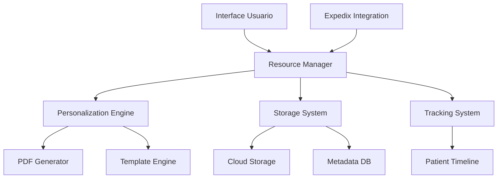
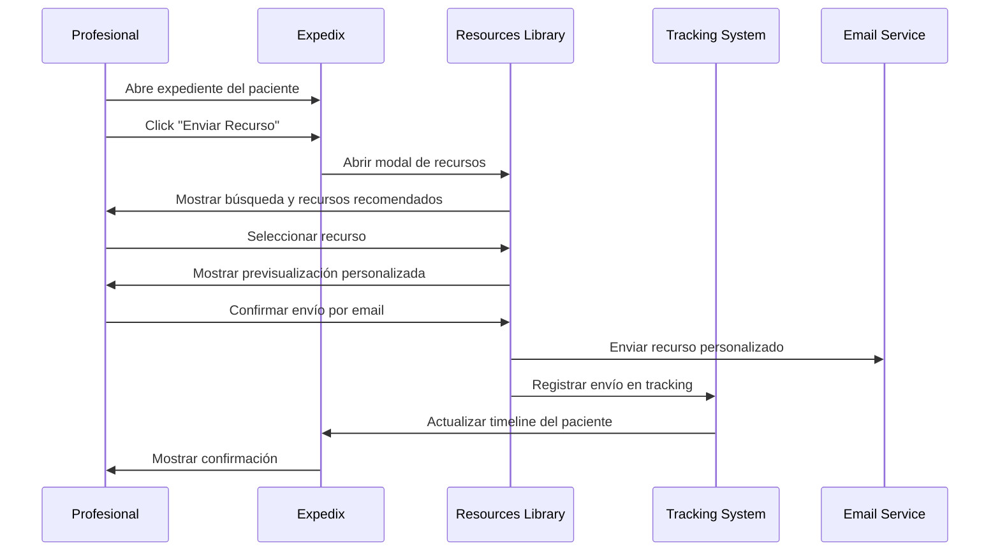
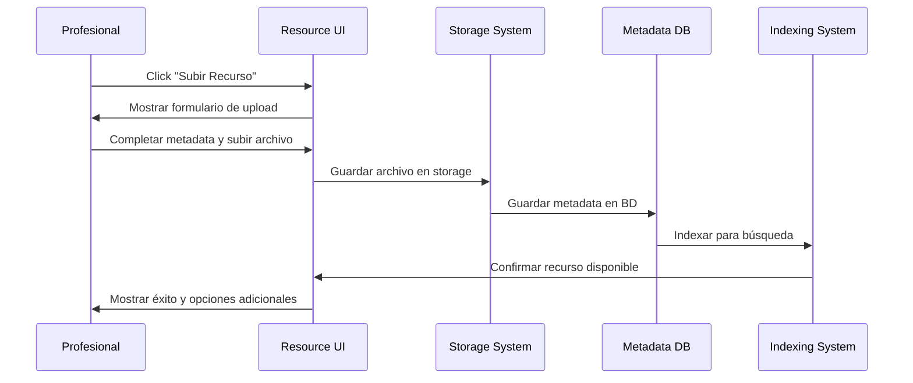

# MindHub Resources Library System - Arquitectura y Diseño

## Resumen Ejecutivo

El sistema de Resources Library de MindHub está diseñado como una biblioteca integral de recursos psicoeducativos que permite a los profesionales de la salud gestionar, personalizar y distribuir materiales terapéuticos de manera eficiente e intuitiva.

---

## 1. Visión y Objetivos del Sistema

### 1.1 Propósito Principal

Crear una biblioteca centralizada de recursos psicoeducativos que permita:

- **Gestión sencilla** de textos, documentos e imágenes terapéuticas
- **Personalización automática** con datos del paciente y clínica
- **Distribución flexible** (impresión, PDFs, envío digital)
- **Integración transparente** con Expedix sin salir del expediente
- **Tracking completo** de recursos enviados por paciente

### 1.2 Casos de Uso Principales

1. **Profesional busca recurso** desde expediente → **Encuentra y envía** → **Se registra en timeline**
2. **Profesional sube nuevo recurso** → **Sistema categoriza** → **Disponible para uso**
3. **Personalización automática** → **Recurso genérico + datos paciente** → **Material personalizado**
4. **Seguimiento de intervenciones** → **Timeline muestra recursos enviados** → **Evita repeticiones**

---

## 2. Arquitectura del Sistema

### 2.1 Componentes Principales



### 2.2 Estructura de Datos

#### Recurso Base
```javascript
const ResourceSchema = {
  id: 'string', // UUID único
  title: 'string', // Título descriptivo
  description: 'string', // Descripción detallada
  type: 'enum', // 'text' | 'pdf' | 'image' | 'template'
  category: 'string', // Categoría principal
  tags: ['string'], // Tags para búsqueda
  content: {
    // Para textos
    rawText: 'string', // Texto original editable
    formattedText: 'string', // Texto con formato
    
    // Para archivos
    filePath: 'string', // Ruta del archivo
    fileName: 'string', // Nombre original
    fileSize: 'number', // Tamaño en bytes
    mimeType: 'string', // Tipo MIME
    
    // Para personalización
    variables: ['string'], // Variables como {nombrePaciente}, {nombreClinica}
    template: 'boolean' // Si permite personalización
  },
  metadata: {
    createdAt: 'timestamp',
    updatedAt: 'timestamp',
    createdBy: 'string', // ID del usuario
    version: 'number',
    downloadCount: 'number',
    useCount: 'number'
  },
  permissions: {
    public: 'boolean',
    allowedRoles: ['string'],
    allowedUsers: ['string']
  },
  personalization: {
    enabled: 'boolean',
    brandingOptions: {
      logoPosition: 'string', // 'header' | 'footer' | 'watermark'
      colorScheme: 'string',
      fontFamily: 'string'
    }
  }
}
```

#### Tracking de Recursos por Paciente
```javascript
const ResourceUsageSchema = {
  id: 'string',
  patientId: 'string',
  resourceId: 'string',
  practitionerId: 'string',
  sessionId: 'string', // ID de consulta si aplica
  sentAt: 'timestamp',
  method: 'enum', // 'email' | 'print' | 'download' | 'view'
  personalizedContent: {
    patientName: 'string',
    clinicName: 'string',
    customVariables: {} // Variables adicionales usadas
  },
  status: 'enum', // 'sent' | 'viewed' | 'downloaded' | 'completed'
  notes: 'string' // Notas del profesional
}
```

---

## 3. Categorización y Organización

### 3.1 Taxonomía de Recursos

#### Categorías Principales
```javascript
const ResourceCategories = {
  // Terapia individual
  'terapia-individual': {
    label: 'Terapia Individual',
    subcategories: [
      'ejercicios-respiracion',
      'tecnicas-relajacion',
      'autorregistros',
      'hojas-de-trabajo',
      'guias-autoayuda'
    ]
  },
  
  // Psicoeducación
  'psicoeducacion': {
    label: 'Psicoeducación',
    subcategories: [
      'ansiedad',
      'depresion',
      'estres',
      'trastornos-alimentarios',
      'adicciones',
      'trastornos-sueno'
    ]
  },
  
  // Instrumentos de evaluación
  'evaluacion': {
    label: 'Instrumentos de Evaluación',
    subcategories: [
      'cuestionarios',
      'escalas',
      'registros-sintomas',
      'diarios-emocionales'
    ]
  },
  
  // Recursos familiares
  'terapia-familiar': {
    label: 'Terapia Familiar',
    subcategories: [
      'comunicacion-familiar',
      'resolucion-conflictos',
      'limites-disciplina',
      'desarrollo-infantil'
    ]
  },
  
  // Recursos grupales
  'terapia-grupal': {
    label: 'Terapia Grupal',
    subcategories: [
      'habilidades-sociales',
      'apoyo-grupal',
      'talleres',
      'actividades-grupo'
    ]
  },
  
  // Administrativo
  'administrativo': {
    label: 'Documentos Administrativos',
    subcategories: [
      'consentimientos',
      'politicas-privacidad',
      'informacion-clinica',
      'formatos-evaluacion'
    ]
  }
}
```

#### Tags Comunes
```javascript
const CommonTags = [
  // Por población
  'adultos', 'adolescentes', 'ninos', 'adultos-mayores',
  
  // Por modalidad
  'presencial', 'online', 'hibrido',
  
  // Por duración
  'sesion-unica', 'proceso-corto', 'proceso-largo',
  
  // Por formato
  'texto', 'imagen', 'infografia', 'checklist', 'ejercicio',
  
  // Por dificultad
  'basico', 'intermedio', 'avanzado',
  
  // Por momento terapéutico
  'inicio-terapia', 'desarrollo', 'cierre', 'seguimiento'
]
```

---

## 4. Sistema de Personalización

### 4.1 Variables de Personalización

#### Variables del Paciente
```javascript
const PatientVariables = {
  // Datos básicos
  '{nombrePaciente}': 'patient.firstName + patient.lastName',
  '{nombrePacienteCompleto}': 'patient.fullName',
  '{primerNombre}': 'patient.firstName',
  '{apellido}': 'patient.lastName',
  '{edad}': 'patient.age',
  '{genero}': 'patient.gender',
  
  // Datos de contacto
  '{email}': 'patient.email',
  '{telefono}': 'patient.phone',
  
  // Datos clínicos
  '{diagnostico}': 'patient.primaryDiagnosis',
  '{medicacion}': 'patient.currentMedications',
  
  // Fechas importantes
  '{fechaHoy}': 'new Date().toLocaleDateString("es-MX")',
  '{fechaProximaCita}': 'patient.nextAppointment',
  '{fechaInicioTerapia}': 'patient.therapyStartDate'
}
```

#### Variables del Profesional y Clínica
```javascript
const PractitionerVariables = {
  // Profesional
  '{nombreProfesional}': 'practitioner.fullName',
  '{tituloProfesional}': 'practitioner.title',
  '{especialidad}': 'practitioner.specialty',
  '{cedula}': 'practitioner.licenseNumber',
  '{email}': 'practitioner.email',
  '{telefono}': 'practitioner.phone',
  
  // Clínica
  '{nombreClinica}': 'clinic.name',
  '{direccionClinica}': 'clinic.address',
  '{telefonoClinica}': 'clinic.phone',
  '{emailClinica}': 'clinic.email',
  '{logoClinica}': 'clinic.logoUrl',
  '{sitioWebClinica}': 'clinic.website'
}
```

### 4.2 Engine de Personalización

```javascript
class PersonalizationEngine {
  constructor() {
    this.templateEngine = new TemplateEngine();
    this.pdfGenerator = new PDFGenerator();
  }
  
  /**
   * Personalizar contenido de texto
   */
  personalizeText(content, variables) {
    let personalizedContent = content;
    
    Object.entries(variables).forEach(([key, value]) => {
      const regex = new RegExp(`\\{${key}\\}`, 'g');
      personalizedContent = personalizedContent.replace(regex, value || '');
    });
    
    return personalizedContent;
  }
  
  /**
   * Personalizar PDF manteniendo formato
   */
  async personalizePDF(pdfPath, variables, brandingOptions) {
    const pdf = await this.pdfGenerator.loadPDF(pdfPath);
    
    // Insertar variables en campos de texto
    pdf.fillTextFields(variables);
    
    // Aplicar branding
    if (brandingOptions.logo) {
      pdf.addLogo(brandingOptions.logo, brandingOptions.logoPosition);
    }
    
    if (brandingOptions.watermark) {
      pdf.addWatermark(brandingOptions.watermark);
    }
    
    return pdf.save();
  }
  
  /**
   * Generar PDF desde texto personalizado
   */
  async generatePersonalizedPDF(content, variables, brandingOptions) {
    const personalizedText = this.personalizeText(content, variables);
    
    const pdfOptions = {
      content: personalizedText,
      branding: brandingOptions,
      layout: {
        margins: { top: 50, bottom: 50, left: 50, right: 50 },
        fontSize: 12,
        fontFamily: brandingOptions.fontFamily || 'Arial',
        lineHeight: 1.5
      }
    };
    
    return await this.pdfGenerator.create(pdfOptions);
  }
}
```

---

## 5. Interfaz de Usuario Sencilla e Intuitiva

### 5.1 Pantalla Principal - Biblioteca de Recursos

```javascript
const ResourceLibraryUI = {
  layout: 'grid', // Vista de tarjetas
  
  header: {
    searchBar: {
      placeholder: 'Buscar recursos por nombre, categoría o tags...',
      filters: ['categoria', 'tipo', 'tags', 'fechaCreacion'],
      quickFilters: ['mis-recursos', 'mas-usados', 'recientes']
    },
    actions: {
      uploadResource: 'Subir Nuevo Recurso',
      createTemplate: 'Crear Template Personalizable',
      bulkUpload: 'Subida Masiva'
    }
  },
  
  sidebar: {
    categories: 'Árbol expandible de categorías',
    recentlyUsed: 'Recursos usados recientemente',
    favorites: 'Recursos marcados como favoritos',
    myResources: 'Recursos creados por el usuario'
  },
  
  mainContent: {
    resourceCards: {
      thumbnail: 'Vista previa del recurso',
      title: 'Título del recurso',
      description: 'Descripción breve',
      tags: 'Tags visuales',
      stats: 'Veces usado, fecha actualización',
      actions: ['ver', 'enviar', 'personalizar', 'editar', 'compartir']
    }
  }
}
```

### 5.2 Modal de Envío desde Expedix

```javascript
const SendResourceModal = {
  trigger: 'Botón "Enviar Recurso" en expediente',
  
  steps: {
    1: {
      title: 'Seleccionar Recurso',
      content: 'Búsqueda rápida y selección',
      searchFilters: ['categoria', 'tipo'],
      recentResources: 'Últimos 10 recursos usados'
    },
    
    2: {
      title: 'Personalizar',
      content: 'Previsualización con variables del paciente',
      options: {
        autoFillPatientData: true,
        customVariables: 'Campos adicionales editables',
        brandingOptions: 'Logo y colores de la clínica'
      }
    },
    
    3: {
      title: 'Enviar',
      methods: ['email', 'print', 'download', 'save-for-later'],
      emailOptions: {
        subject: 'Auto-generado personalizable',
        message: 'Template de mensaje personalizable',
        attachmentName: 'Nombre del archivo personalizable'
      }
    }
  }
}
```

---

## 6. Integración con Expedix

### 6.1 Puntos de Integración

#### En el Expediente del Paciente
```javascript
const ExpedixIntegration = {
  // Botón en toolbar del expediente
  resourceButton: {
    location: 'main-toolbar',
    icon: 'library-icon',
    label: 'Recursos',
    quickActions: [
      'enviar-recurso',
      'ver-recursos-enviados',
      'buscar-recursos'
    ]
  },
  
  // Integración con Timeline existente de Expedix
  timelineIntegration: {
    location: 'expedix-patient-timeline', // Timeline ya establecido en Expedix
    newEntryType: 'resource-sent',
    entryFormat: {
      icon: 'resource-icon',
      title: 'Se envió recurso: {nombreRecurso}',
      timestamp: 'fechaEnvio',
      description: 'Por {metodaEnvio} - {notasProfesional}',
      actions: ['ver-recurso', 'reenviar', 'marcar-completado']
    },
    apiIntegration: 'POST /api/expedix/patients/{id}/timeline/add-resource-entry'
  },
  
  // Widget en sidebar
  resourceWidget: {
    location: 'right-sidebar',
    title: 'Recursos del Paciente',
    content: {
      recentSent: 'Últimos 5 recursos enviados',
      recommendations: 'Recursos sugeridos basados en diagnóstico',
      quickSend: 'Recursos favoritos del profesional'
    }
  }
}
```

#### API de Integración
```javascript
const ExpedixResourceAPI = {
  // Obtener recursos enviados a un paciente
  'GET /api/patients/{id}/resources': {
    response: 'Lista de recursos enviados con metadata'
  },
  
  // Enviar recurso a paciente
  'POST /api/patients/{id}/resources/send': {
    body: {
      resourceId: 'string',
      method: 'email | print | download',
      personalization: 'variables y opciones',
      notes: 'string'
    }
  },
  
  // Obtener recursos recomendados
  'GET /api/patients/{id}/resources/recommendations': {
    response: 'Recursos sugeridos basados en perfil del paciente'
  },
  
  // Marcar recurso como completado
  'PUT /api/patients/{id}/resources/{resourceUsageId}/complete': {
    body: { notes: 'string', completedAt: 'timestamp' }
  }
}
```

---

## 7. Sistema de Tracking y Analytics

### 7.1 Tracking por Paciente

```javascript
const PatientResourceTracking = {
  // Integración con Timeline de Expedix existente
  expedixTimelineEntry: {
    type: 'resource-sent',
    title: 'Se envió recurso: Técnicas de Respiración para la Ansiedad',
    timestamp: '2025-07-20T10:30:00Z',
    description: 'Por email - Técnicas para practicar entre sesiones',
    practitioner: 'Dr. Ana García',
    metadata: {
      resourceId: 'uuid',
      resourceTitle: 'Técnicas de Respiración para la Ansiedad',
      category: 'terapia-individual',
      method: 'email',
      status: 'sent'
    }
  },
  
  // Dashboard de recursos del paciente
  resourceSummary: {
    totalSent: 'number',
    byCategory: 'object',
    byStatus: 'object',
    mostRecentActivity: 'timestamp'
  },
  
  // Prevención de duplicados
  duplicateCheck: {
    enabled: true,
    warning: 'Este recurso ya fue enviado al paciente el {fecha}',
    options: ['enviar-de-nuevo', 'cancelar', 'ver-original']
  }
}
```

### 7.2 Analytics para Profesionales

```javascript
const ResourceAnalytics = {
  // Dashboard personal
  practitionerStats: {
    mostUsedResources: 'Top 10 recursos más enviados',
    resourcesByCategory: 'Distribución por categorías',
    patientEngagement: 'Tasa de recursos completados por pacientes',
    timeUsage: 'Tiempo promedio desde envío hasta completado'
  },
  
  // Dashboard de clínica
  clinicStats: {
    totalResourcesAvailable: 'number',
    totalResourcesSent: 'number',
    topResources: 'Recursos más utilizados en la clínica',
    practitionerUsage: 'Uso de recursos por profesional',
    patientEngagement: 'Engagement promedio de pacientes'
  }
}
```

---

## 8. Flujos de Trabajo Principales

### 8.1 Flujo: Profesional Envía Recurso desde Expedix



### 8.2 Flujo: Subida de Nuevo Recurso



---

## 9. Implementación Técnica

### 9.1 Stack Tecnológico

```javascript
const TechStack = {
  backend: {
    api: 'Node.js + Express',
    database: 'MySQL (Prisma) + Firestore (recursos)',
    storage: 'Cloud Storage (archivos)',
    search: 'Elasticsearch (metadata)',
    queues: 'Bull + Redis (processing)'
  },
  
  frontend: {
    framework: 'React + Next.js',
    ui: 'Material-UI / Tailwind CSS',
    fileUpload: 'react-dropzone',
    pdfViewer: 'react-pdf',
    editor: 'TinyMCE / Quill.js'
  },
  
  services: {
    email: 'Nodemailer + SendGrid',
    pdf: 'PDFKit + Puppeteer',
    imageProcessing: 'Sharp',
    textProcessing: 'Natural.js'
  }
}
```

### 9.2 Estructura de Directorios

```
mindhub/backend/resources/
├── controllers/
│   ├── ResourceController.js        # CRUD de recursos
│   ├── PersonalizationController.js # Personalización
│   ├── TrackingController.js        # Tracking y analytics
│   └── UploadController.js          # Subida de archivos
├── services/
│   ├── ResourceService.js           # Lógica de negocio
│   ├── PersonalizationService.js    # Engine de personalización
│   ├── StorageService.js            # Gestión de archivos
│   ├── EmailService.js              # Envío de emails
│   ├── PDFService.js                # Generación y personalización PDF
│   └── SearchService.js             # Búsqueda y filtrado
├── models/
│   ├── Resource.js                  # Modelo de recurso
│   ├── ResourceUsage.js             # Modelo de tracking
│   └── ResourceCategory.js          # Modelo de categorías
├── routes/
│   ├── resources.js                 # Rutas principales
│   ├── upload.js                    # Rutas de subida
│   ├── personalization.js           # Rutas de personalización
│   └── analytics.js                 # Rutas de analytics
├── middleware/
│   ├── upload-middleware.js         # Middleware de archivos
│   ├── validation-middleware.js     # Validación de recursos
│   └── tracking-middleware.js       # Middleware de tracking
└── utils/
    ├── template-engine.js           # Engine de templates
    ├── pdf-generator.js             # Generador de PDFs
    ├── file-processor.js            # Procesador de archivos
    └── search-indexer.js            # Indexador de búsqueda
```

---

## 10. Cronograma de Implementación

### Fase 1: Infraestructura Base (1 semana)
- ✅ Diseño de arquitectura (Subtarea 7.1) 
- ⏳ Schema de Firestore (Subtarea 7.2)
- ⏳ Modelos y controladores básicos

### Fase 2: Funcionalidades Core (2 semanas)
- ⏳ Sistema de upload (Subtarea 7.7)
- ⏳ Búsqueda y filtrado (Subtarea 7.5)
- ⏳ Engine de personalización

### Fase 3: Integración con Expedix (1 semana)
- ⏳ APIs de integración
- ⏳ UI en expediente del paciente
- ⏳ Sistema de tracking (Subtarea 7.6)

### Fase 4: Testing y Optimización (1 semana)
- ⏳ Tests completos (Subtarea 7.8)
- ⏳ Optimización de performance
- ⏳ Documentación final

---

**Estado**: ✅ Arquitectura Completa - Lista para Implementación  
**Próximo Paso**: Subtarea 7.2 - Diseño del Schema de Firestore